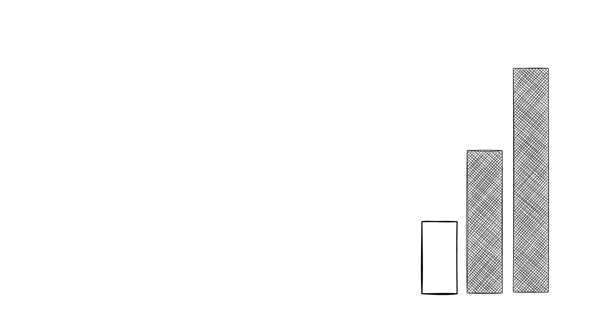
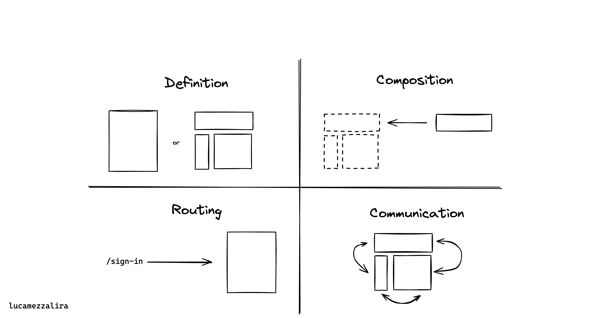
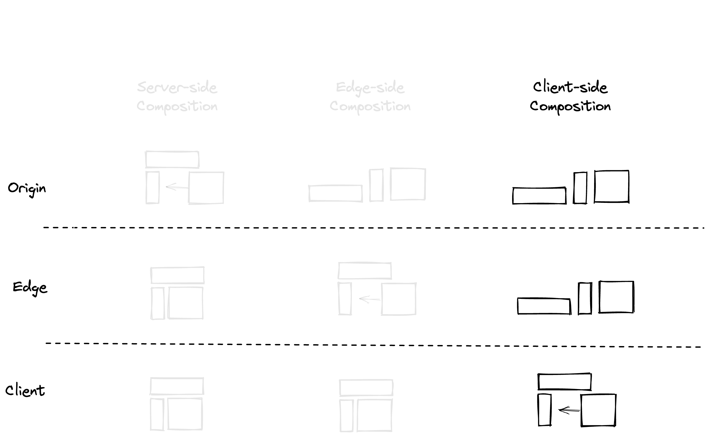
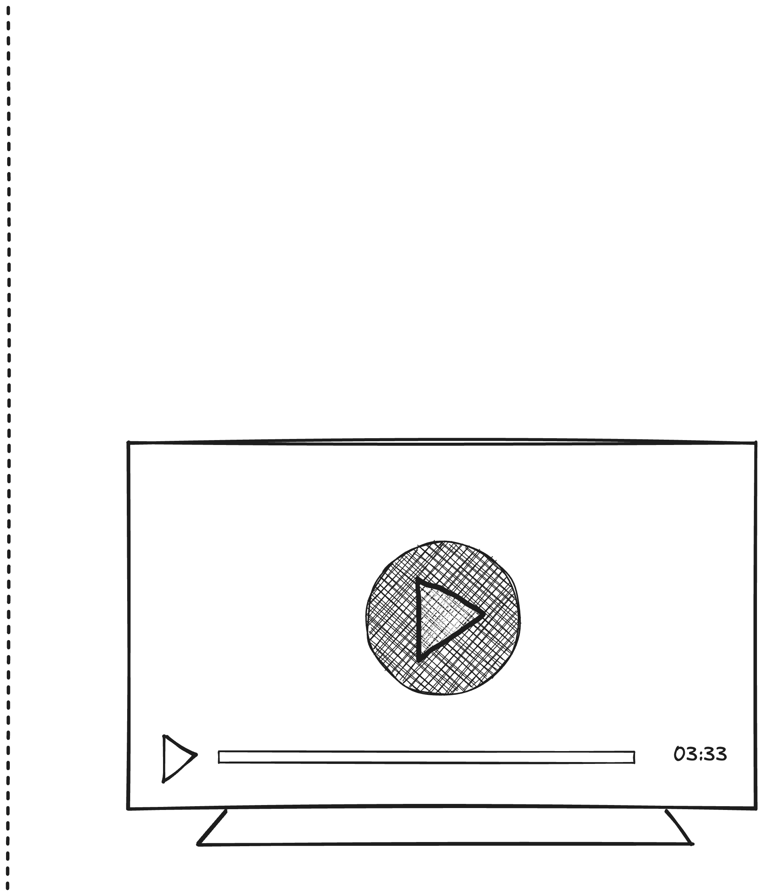
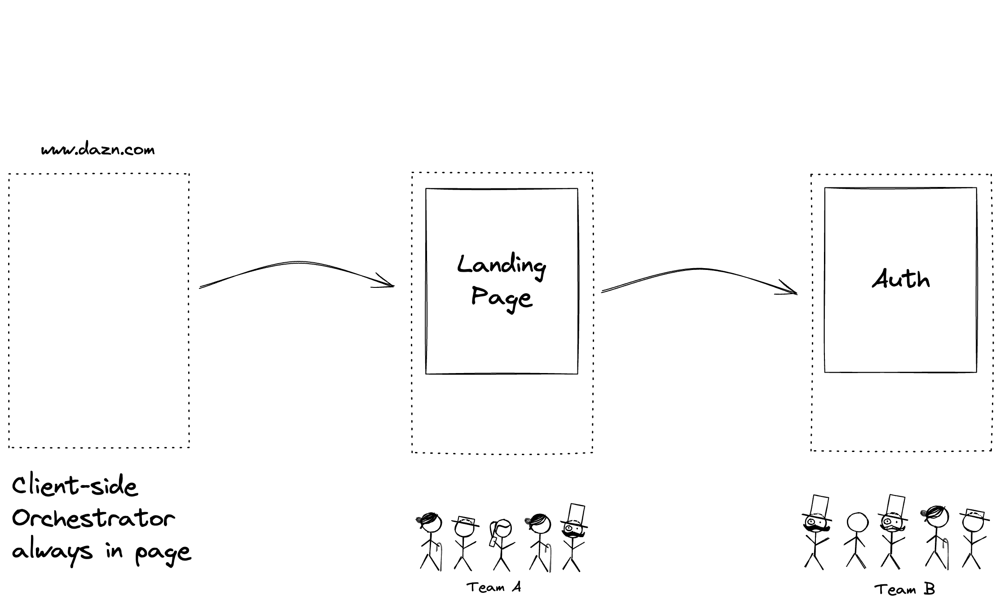
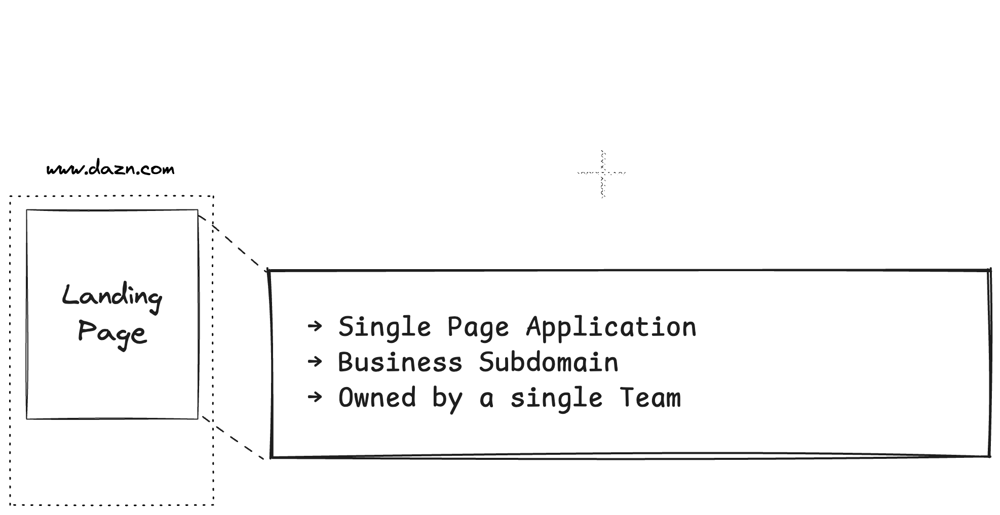
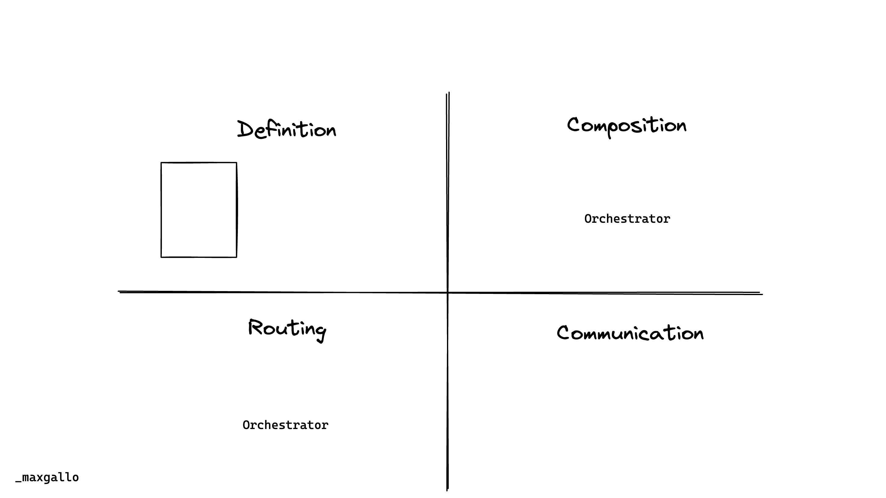
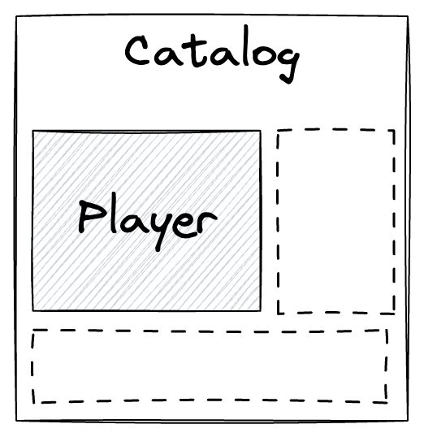
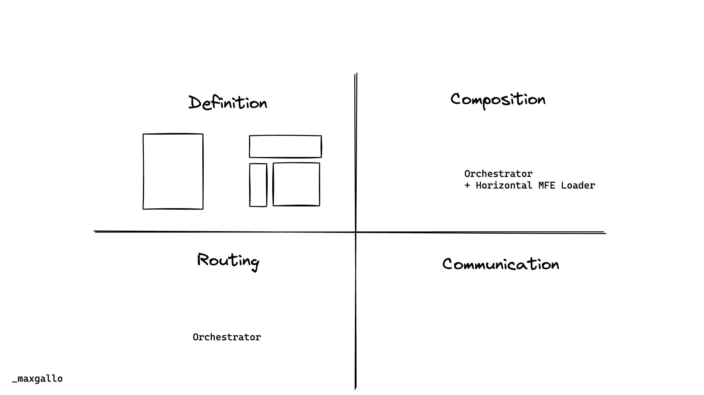

theme: Inter, 2

# [fit] Micro-frontends
### [fit] **five years after**

 
 
 

### @**_maxgallo**

---

## __In 2019 I was on stage with__ Luca Mezzalira __to introduce DAZN approach to__ Micro-frontends

^ March 2019
^ Incredible response / feedback / questions

                   
https://bit.ly/talk-max-luca

---

<!--

Intro
    - DAZN Context
        - Product
        - Number of teams
    - Three Years ago
        - 6 Vertical MFE (catalog, auth, landingpage, help, myaccount, error)
        - Bootstrap: clientside orchestrator
        - Not a single line of code shared
        - Autonomous teams

Challenges
  - Vertical MFE where too big
    - How to spot the signs
        - release trains
        - cross teams coordination needed
    - What we put in place
        - systemJS wrapper
        - Comparison: Module Federation or Single-SPA ?
  - Extreme of autonomy -> Silo
    - How to spot the signs
        - Principal Engineers or cross team tech people
    - What to put in place
        - FE Guilds
        - RFC
        - Service Discovery: Backstage
  - Sharing: is it a problem?
    - Visual Inconsistencies
    - What are we sharing
        - payments
        - experiments
        - payments
Takeaways
  - Re evaluate the decisions (And keep Decision Records)
  - Think about sharing but don't use "number of shared components" as metric
  - aaaaa

-->

# From Then to Now

## ☞ __Once Upon a Time__

---

# From Then to Now

## ☞ __Once Upon a Time__
## ☞ __Adapting to Change__

---

# From Then to Now

## ☞ __Once Upon a Time__
## ☞ __Adapting to Change__
## ☞ __Sharing Ideas & Sharing Code__

---

# [fit] Hi 👋 I'm Max

### 🇮🇹 🇬🇧 🍝 💻 🎶 🏍 📷 ✈️ ✍️

### **Distinguished Engineer @ DAZN**

          

### web: **maxgallo.io**
### twitter: @**_maxgallo**

---

# [fit] Hi 👋 I'm Max

### 🇮🇹 🇬🇧 🍝 💻 🎶 🏍 📷 ✈️ ✍️

### **Distinguished Engineer @ DAZN**

          

### web: **maxgallo.io**
### x: @**_maxgallo**

---

[.column]
# [fit] __Once Upon a Time__
### Part 1 of 3

[.column]
 

---

# __Once Upon a Time, there was a Live Sport Streaming Company called__ DAZN

---

[.column]
# __DAZN Engineering department was growing__ exponentially

[.column]
 

---

# __To sustain our teams growth plans so we introduced__ Micro-frontends

---

# [fit] PAUSE

---

[.background-color: #F5A91B]

# [fit] __Micro-Frontends__ Decision Framework

---

[.background-color: #F5A91B]

# [fit] __Decision Framework__ Definition

^ - Vert: Module Federation, Single SPA

---

[.background-color: #F5A91B]
# [fit] __Decision Framework__ Definition

 

[.column]

## Vertical

### ☞ _Ownership & Freedom End to End_
### ☞ _Easier to Support_

[.column]

## Horizontal

### ☞ _Release part of a view_
### ☞ _Favor Reusability_
### ☞ _Harder to orchestrate_

^ - Vertical could be Multi Fraemework
- Horizontal can own one or more MFE

---

[.background-color: #F5A91B]
# [fit] __Decision Framework__ Composition

^ - Server: Good for very slow clients
- Can cache on CDN

---

[.background-color: #F5A91B]
# [fit] __Decision Framework__ Composition

^ - Edge: Good for very slow clients
- Edge Side Include (ESI)

---

[.background-color: #F5A91B]
# [fit] __Decision Framework__ Composition

---

[.background-color: #F5A91B]
# [fit] __Decision Framework__ Composition

^ - Consider your Caching strategy
- Consider your FE clients (eg. memory available)

---

[.background-color: #F5A91B]
# [fit] __Decision Framework__ Routing

[.column]
## Origin/Server

### ☞ _Both Horiz & Vert_

[.column]
## Edge

[.column]
## Client

---

[.background-color: #F5A91B]
# [fit] __Decision Framework__ Routing

[.column]
## Origin/Server

### ☞ _Both Horiz & Vert_

[.column]
## Edge

### ☞ _Not common_
### ☞ _Idea: canary releases & AB testing_

[.column]
## Client

---

[.background-color: #F5A91B]
# [fit] __Decision Framework__ Routing

[.column]
## Origin/Server

### ☞ _Both Horiz & Vert_

[.column]
## Edge

### ☞ _Not common_
### ☞ _Idea: canary releases & AB testing_

[.column]
## Client

### ☞ _Always download app-shell first_
### ☞ _(Vertical) Routing Prefix ownership_

---

[.background-color: #F5A91B]
# [fit] __Decision Framework__ Communication

  

[.column]
## Vertical

### ☞ _Browser storage_
### ☞ _Url params_

[.column]
## Horizontal
### ☞ _Event Bus (very popular)_
### ☞ _Host config (eg. React Props)_

^ - Watch out for URL lenght

---

[.background-color: #F5A91B]

# [fit] __Micro-Frontends__ Decision Framework

---

# [fit] PLAY

---

# __DAZN__ Composition & Routing

^ Single Page Application
^ Orchestrator does the routing as well

---

# __DAZN__ Orchestrator

---

# __DAZN__ Vertical Micro-Frontend

---

# [fit] __DAZN 2019__ Frontend Architecture

^ 6 Vertical MFE (catalog, auth, landingpage, help, myaccount, error)
^ Bootstrap: clientside orchestrator
^ Not a single line of code shared
^ Autonomous teams

---

# __DAZN 2019__ Decision Framework

---
...and they lived happily ever after

^ - For a while
  - Anecdote: First Time someone released a Micro Frontends without involving me, I was super happy

---

...and they lived happily ever after
#[fit] __Nope!__

---

[.column]
# [fit] __Adapting to Change__
### Part 2 of 3

[.column]
 

---

# __It's not easy to define__ Domain Boundaries

---

[.column]
# __Some vertical Micro-frontends were__ too big __for a single team__

^ Release Trains
^ Cross-teams coordination needed
^ Evolution of the boundaries

                     

### @**_maxgallo**

[.column]
 

---
# __Our business subdomains are not immutable so we re-defined their__ boundaries

^ We merged microfrontends
^ Runtime Approach doesn't change, there's always one team in every view
^ there are limits for this

---

# __A Subdomain did contain a complex subsystem[^1] that__ was not considered a Micro-frontend

[^1]: From "Team Topologies"

^Ownership is at least a page.
^If we step back a second, going high level

---

# [fit] __Micro-frontends__ Vertical & Horizontal[^2] split

[^2]: Module Federation, Single SPA

---
<!--
[.column]
# __Deep Dive into__ Horizontal Micro-frontends

[.column]
 

## ☞ __Multiple Teams owning parts of the same view__
## ☞ __Coordination needed__
## ☞ __Independent Releases__

---
-->

[.column]
# __Deep Dive into Horizontal Micro-frontends in__ DAZN
    
☞ SystemJS
☞ Relationship with host
☞ Autonomy in non-breaking  changes

[.column]
 

^ Wrapper Around SystemJS
^ Breaking Changes releases (major in semver) are blocked by host
^ Other releases (Minor & patch) are owned by team

---

# [fit] __DAZN 2025__ Frontend Architecture

^ - Developer Experience effort
  - This is not cheap to build 

---

# [fit] __DAZN 2025__ Decision Framework

---

[.column]
# [fit] __Sharing Ideas & Sharing Code__
### Part 3 of 3

[.column]
 

^ Need to take care of the human part

---
# __Autonomous Teams are at risk of creating__ Knowledge Silos

^ How to spot the signs
^ Principal Engineers or cross team tech people

                    

### @**_maxgallo**

---

[.column]
# __Share Knowledge__ across Teams

[.column]
     
## ☞ __Internal Meetups__
## ☞ __Principals & Staff Eng__
## ☞ __Plan it !__

<!--

[.column]
# __Favor local decisions__ but have a plan for global decisions
                    

### @**_maxgallo**

[.column]
     
## ☞ __Request For Comments (aka RFC)__
## ☞ __Architecture Decision Records (aka ADR)__

^ even for small things
-->

---

# __Enable Discovery__ beyond Teams

   
### ☞ __Developer Experience__ DX
### ☞ __Backstage (Spotify)__

---

[.column]
# __We're now sharing ideas__ Should we also share code?

[.column]
 

---

# __To favor teams independence, we__ duplicated by design

^ Lots of push back

---

# __What's important for__ you __?__

---

# __Not a single__ visual __component has been shared across all the Micro-frontends,__ yet

^ Not an easy journey
^ why "visual"

                

### @**_maxgallo**

---

[.column]
# __In DAZN, we're sharing some components to reflect__ company priorities

^ New Phase soon (company is more mature)
^ something currently shared: payments (business critical)

                
### @**_maxgallo**

[.column]
             

---
# __What are we sharing__

 

[.column]
## ☞ Payments
Critical component

[.column]
 

[.column]
 

---

# __What are we sharing__

 

[.column]
## ☞ Payments
Critical component

[.column]
## ☞ Analytics
Risks of Fragmentation

[.column]
 

---

# __What are we sharing__

 

[.column]
## ☞ Payments
Critical component

[.column]
## ☞ Analytics
Risks of Fragmentation

[.column]
## ☞ Experiments
Hard to provide autonomy

---

# [fit] Takeaways

 

__☞__ Your business subtomains, and your Micro-Frontends, are _not immutable_
 
 

### @**_maxgallo**

---

# [fit] Takeaways

 

__☞__ Your business subtomains, and your Micro-Frontends, are _not immutable_
__☞__ Sharing code is a _solution_ to a problem - not a _goal_
 

### @**_maxgallo**

---

# [fit] Takeaways

 

__☞__ Your business subtomains, and your Micro-Frontends, are _not immutable_
__☞__ Sharing code is a _solution_ to a problem - not a _goal_
__☞__ It's always about _People_

### @**_maxgallo**

---

 

#[fit] Thank You

# **github.com/maxgallo/talk-micro-frontends-five-years-after**

 

### @**_maxgallo**

